`go_to_yanbaru` 
※正月の帰省時に写真を撮ってから投稿するつもりだったのですが、ふるさと納税の更新？タイミングが12/31らしいので、一部は画像なしで投稿します 
※写真撮り次第更新します 

--- 

沖縄のふるさと納税色々調べていたら 
https://www.satofull.jp/products/detail.php?product_id=1578846&query_id=13998415-36cb-4f40-8057-00051395214b 
 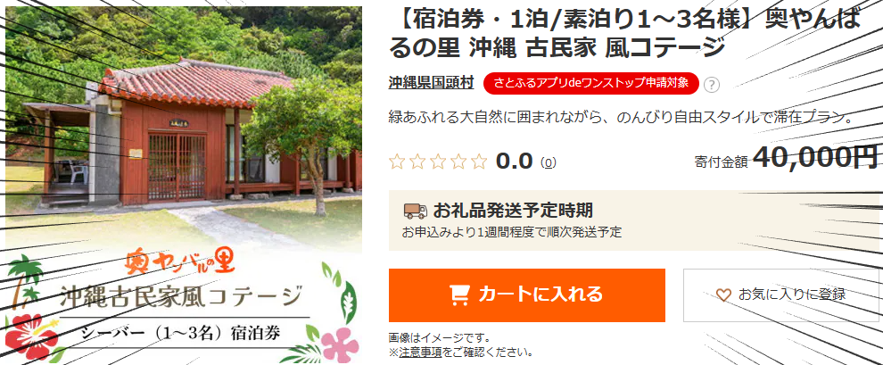  
自分のお気に入りのペンションが出品されてました 

地元貢献も兼ねて、奥やんばるの里の宣伝です 

--- 
--- 

沖縄の自然を思いっきり楽しみたい... 

でも、危険な場所は行きたくない... 

子供たちのためにも、安心・安全な場所がいい... 

けど、大人の自分たちだって楽しみたい！ 

**その願い、すべて叶えます** 
**そう、奥やんばるの里なら！！！** 
# 奥やんばるの里とは！？
 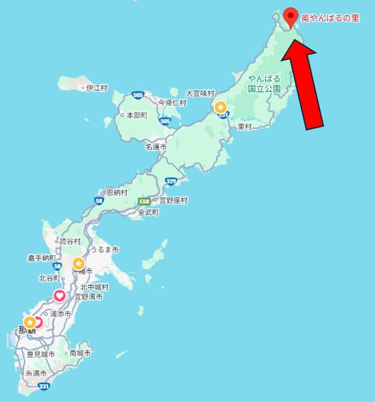  
**沖縄の超最北端！！** 
国頭村奥に存在する、雄大な自然に囲まれたすごいところ！！ 
 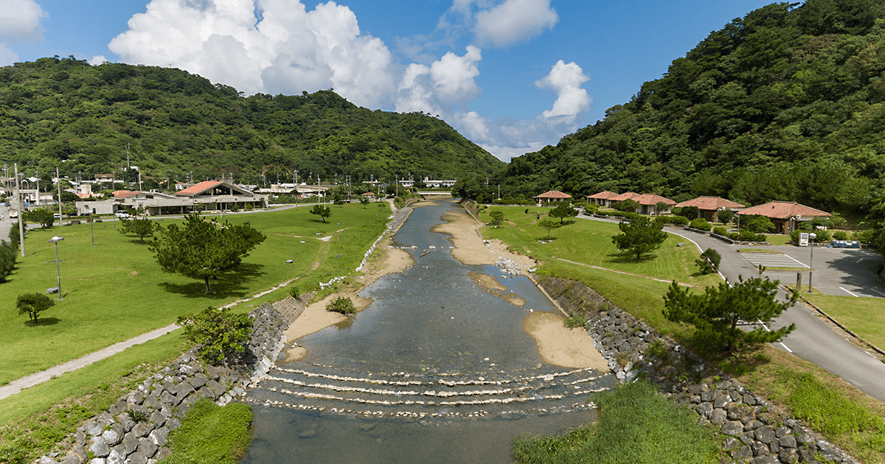  
やんちゃな学生から、家族まで、誰だって楽しめる！ 
安心安全、そのうえで刺激的な遊びが盛りだくさんの 
(個人的には)沖縄NO.1のペンションです 

# その魅力とは！！
## 奥川
このペンション最大の特徴 
なんと、**ペンションから約30mの距離に川があります** 

**沖縄の全ての川を巡った自分が断言します** 

**この川、** 
**「家族で楽しめる川」としては圧倒的にNo.1です** 

なぜか？ 

それは―― 

**安全に遊べるよう整備されている** 
**それでいて、生き物はたくさんいる！！** 

これが両立できている数少ない川だからです 
### <u>まず安全性！</u>
 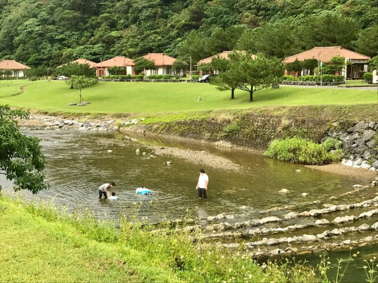  
この写真だけで大体伝わるのではないでしょうか 

まず第一に、**浅いので子供がおぼれる心配がありません** 
ほとんどのところは大人であれば膝下まで届かない程度には水深が浅く、溺れる心配はないです 

そして**川の周辺がめっちゃ整備されてます** 
ペンションから川への動線は芝生で整備されているので、ハブなどの脅威もほとんどないです 

ここまで安全なところはかなり珍しいです 

海みたいに岩が鋭くない、危険な生き物が少ないうえ、この好条件なので、 
沖縄で自然に触れられて、安全な場所として一番なんじゃないかな 
### <u>そして豊富な生態系！</u>
奥やんばるの里が位置するこの川は、<u>奥川の下流・ほぼ汽水域</u>にあたります 
そのため、満潮時には海水が入り込み、川と海の栄養が混ざり合う環境になっています 

その影響か、 
**整備された川としては珍しく、生き物がとても豊富**です 
というか遊べるように整備された川自体が珍しい 

 

どんな生き物がいるの？
 

#### <u>通常時にみられる生き物</u>
普段の水位だと、主に以下 
- ハゼ
- 小エビ
- 名前は分からないけど、ちっちゃい小魚たち
- 運が良ければ　**テナガエビ**

人にとって**脅威になる生き物は、ほとんど見かけないです** 

> ※テナガエビは沖縄県の[希少野生動植物種](https://www.pref.okinawa.jp/_res/projects/default_project/_page_/001/004/865/zyourei_panhu_dai3han.pdf)に指定されてます、食べないように！ 

#### <u>満潮時に見られる生き物</u>
汽水域なので、潮が満ちてくると海の生き物が入ってきます 
とはいえ、かなり浅い川なので、 
**危ないものが入ってくることはほとんどないです** 

結構いろんなのが入ってくるので、見られる生き物はほぼランダムにはなりますが、 
今までで見れたものの例としては 
- ハコフグ(8cmくらい)
- 小魚の群れ
- タツノオトシゴ

など 
なかでも、**ハコフグはほぼ毎回、** 
**小魚の群れもかなり高頻度**で見れます 

小魚の群れは、それを狙ってやってくる中型の魚の影響で、 
水面近くを一斉に跳ね回る瞬間が見られることもあり、 
この時間帯ならではの見どころのひとつです 

 

## 綺麗な施設
**ペンションあるある！！** 
**行ってみたら設備がちゃっちい！汚い！古い！！** 

これメチャクチャ心配ですよね 

**大丈夫です、ここの設備****超綺麗****です** 

### 外観
 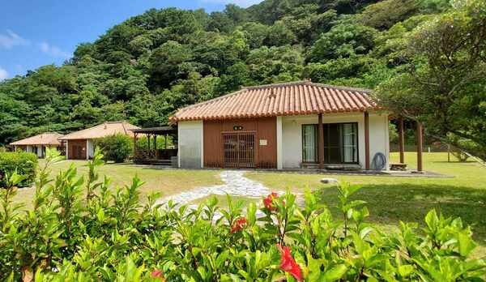  

### 内装
 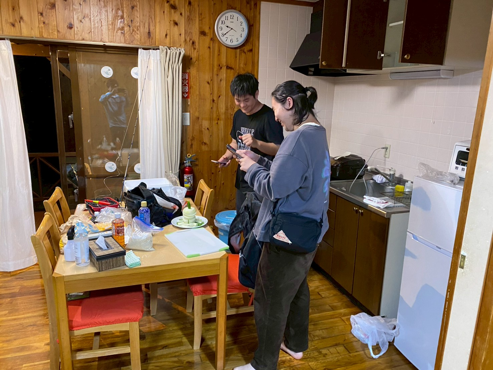  
 
1 ~ 3人用の志場（シーバー）がこんな感じ 
   
風呂場 
 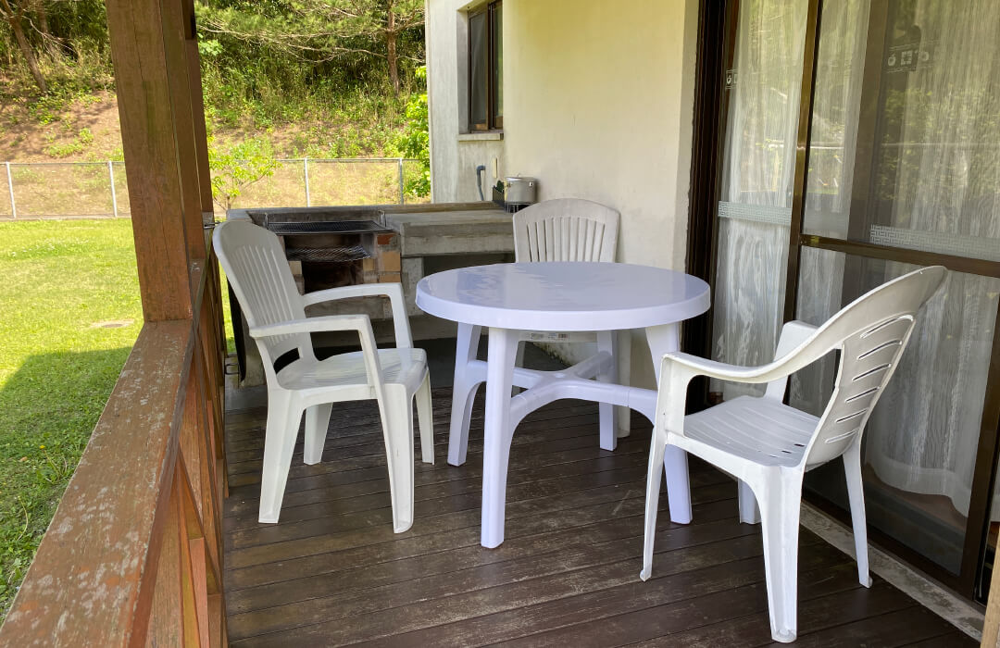  
ベランダ 
 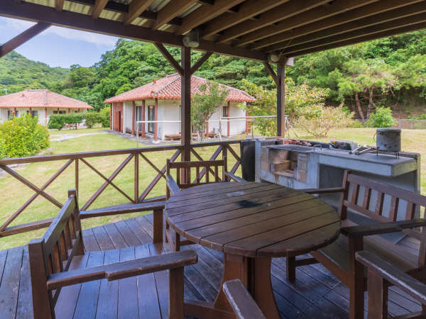  
1 ~ 5人用の尾西（ウニシ）だとベランダが豪華になります 

# この場所の楽しみ方
### 川を楽しむなら
手ぶらでも楽しいですが、いろいろ準備しとくともっと楽しいです 

 

詳細
 

潮の満ち引きで居るものがかなり変わるので、あらかじめ調べておくことをお勧めします 
https://www.surf-life.blue/weather/tide_level/%E5%9B%BD%E9%A0%AD%E6%9D%91%28%E8%BE%BA%E5%9C%9F%E5%90%8D%29 

川を楽しむために、道具を買うのもおすすめです 
自分のおすすめは以下 

**アクアスコープ** 
 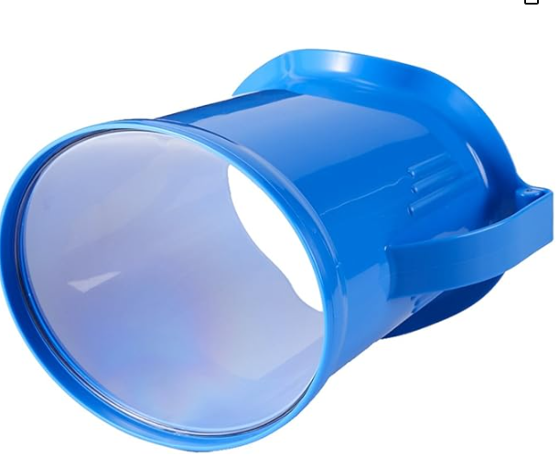  
https://amzn.asia/d/7Unbd7c 
水中の生き物を見るのに最適です、子供向けではありますが大人が使っても結構楽しいです 

**水中用網** 
 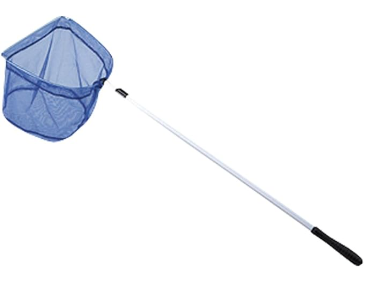  
https://amzn.asia/d/97yCqUP 
網の先端が平たいこのタイプが一番最適です　水中での利用なら一番汎用的に使えるのがこのタイプです 
割といろんなとこで売ってます 

**奥やんばる限定網** 
写真はないですがこの奥やんばる唯一の商店、奥共同店で売っているおそらく手作りの針金と透明な糸で作られたシンプルな網 
目が粗く、小魚などをとるのには向きませんが、手長エビをとるのにはメチャクチャ向いています 
あったら是非買ってみてください 

 

### 早朝限定！ミジュン釣り！
ほとんど入れ食い！初めての釣りなら自分はこれをお勧めします 
獲物も小さいので子供でも簡単に取れます 
早起きだけ頑張って（午前4時） 

 

詳細
 

 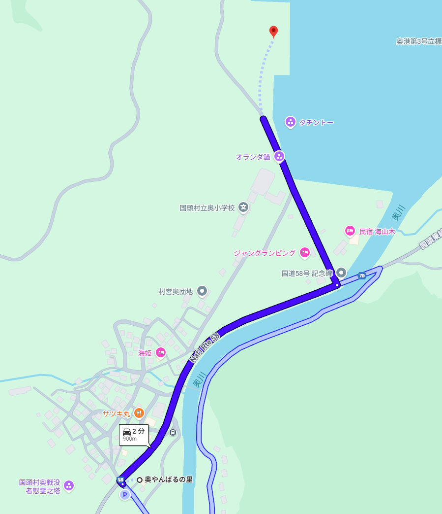  
奥やんばるから歩いて15分、奥港では早朝限定でミジュンの群れが現れることがあります 
頑張って朝の4時くらいに起きましょう 
 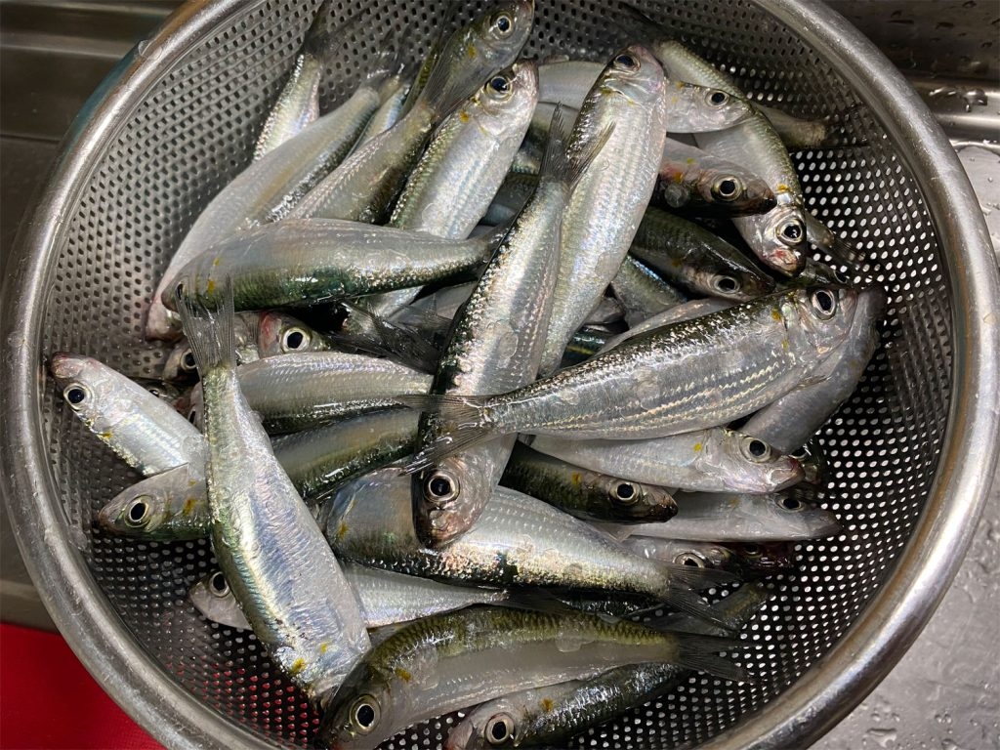  
↑これがミジュン　これの大群が港の壁面を端から端まで往復し続けます 
 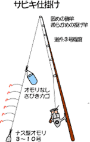  
仕掛けはこんな感じ、一般的なサビキ釣りと呼ばれる仕掛けです 
サビキかごに餌のオキアミを入れ、水中に落とした後仕掛けを軽く振って中の餌をばらまきます 
集まってきたミジュンを餌に見せかけた針に食わせて釣ります 

仕掛けは全部、奥共同店で揃います 
ミジュン用の仕掛けセットが丸々売られているので特に難しいセットもいりません 
後はオキアミと釣り竿 
釣り竿は何使っても大丈夫です　何ならダイソーの安い釣り竿とかで十分 
確か奥共同店でもちょうどいい竿があった...はず？ 

> ※注意！！　: 奥共同店は朝07:00から営業開始です、当日に買うと間に合わないので、前日のうちにオキアミ、仕掛け類は買っておきましょう 

 

### BBQ
なんだかんだ、一番思い出として残るのはこの時間です 

 

詳細
 

炭、食材など、必要なものはたいてい奥共同店で揃います　ちゃんとバーベキュー向けにしっかりしたのが売っているので正直ここで揃えちゃえばいいです 

ただ、18時には閉まるので、それまでにあらかじめ買っておきましょう 
近くに奥共同店以外に売店は一つもありません　これを忘れるとたまに詰みます 

昔、 
食材は自然の中で現地調達するからいらねぇ！！ 
と意気込んで何も買わず、そのうえなにもとれなかった結果、ひもじい思いをしたことがありました 

気を付けましょう 

 

# 真・この場所の楽しみ方
ここまでの説明を聞いて、こう思った方がいるのではないでしょうか 

**刺激が足りない** 

せっかく沖縄に来て、大自然を味わいに来たのに 
あるのは泳ぐにはあっさい川だけ 
生き物も満潮を狙わなければ、ちっちゃい小魚、良くて手長エビ 

このままだと 

**ただ川ではしゃぎまわり、花火を楽しみ、** 
**夜にはBBQを楽しみ、大自然できれいな夜空を楽しみながら夜を過ごす―** 

**そんなありきたりな楽しみ方しかできない！！** 

**魚をモリで突いたり、イノシシ追い掛け回したり――** 
大人になる過程で誰しも一度はやるであろう、そういったやんちゃ  

**そういう刺激が欲しい！！** 
そう思ったはず 

てことで、ここからは大人向け、刺激的な遊びの紹介です 

## 川遊び ～夜の部～
人気のなくなったド深夜 

ココには奴が現れます 
  写真は拾い画です、獲り次第更新します 
**そう、川のヌシ、オオウナギ！！** 
**体長最大2メートル、体重20kg**にもなる巨大生物です 

どうやって獲ると思います？　釣り？　生ぬるいですね 

**整備され、**<u>**夜でも入れるほど安全な川**</u> 
**浅く、**<u>**水底まで見える環境**</u> 

**ここまで完璧な状況がそろっている、ならばやることは一つ！！** 
### <u>オススメのモリ</u>
結論から言うと、以下条件が揃ったものを買っておけばOKです 
- 3 ~ 4本刃
- ゴム付き

モリは「初心者なら3 ~ 4本刃、上級者なら1本刃」とよく聞きますが 
ウナギ相手であれば確実に3 ~ 4本刃がいいです 

ウナギは筋肉質で力が強く、そして思ったより肉が柔らかいので 
刺して5秒くらいでモリに絡みついて、自らの身体を切って逃走します 

 

ちょっとだけ閲覧注意
 

 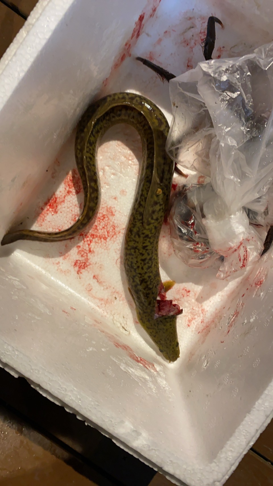  
前回行ったときに撮った写真です 
大体50cmくらい　これでもちょっと獲ったの可哀想だったなって考えちゃうようなサイズです 

 

一本刃はしっかり刺さるというメリットがありますが、三本刃でもウナギが柔らかいのでゴムのパワーだけで余裕で貫通します 
なので、当てやすく、身体を切りづらい3 ~ 4本刃が最適です 

ゴムはあるだけで狙いやすさが全然違うので出来ればあるやつを買いましょう 
> ※ゴム付きは禁止されている地域もあるので、使用する際はちゃんと調べましょう！場所によってはモリ事態×です 

奥共同店にもモリは売ってますが、一本刃なのでできればあらかじめ買うことをおすすめします 
釣り具屋にも結構置いてるのでそっちを探すなど、ただそれでも買える確証はないのでAmazonとかがいいかも 

### <u>いざ川へ</u>
モリとライト、クーラーボックス持っていざ川へ！ 
ライトは自転車用の充電式ライトがオススメです　ちっちゃい割にめっちゃ強いです 
#### 探し方
ウナギは基本大きめの岩に纏うような形でいるので、大きめの岩を重点的に探しましょう 
近づいても基本逃げずにじっとしてるので、ゆっくり探して大丈夫です 
むしろ水面ギリギリまで顔近づけてよーく見ないと気づけないぐらい擬態能力が高いので一か所にしっかり時間かけましょう 
 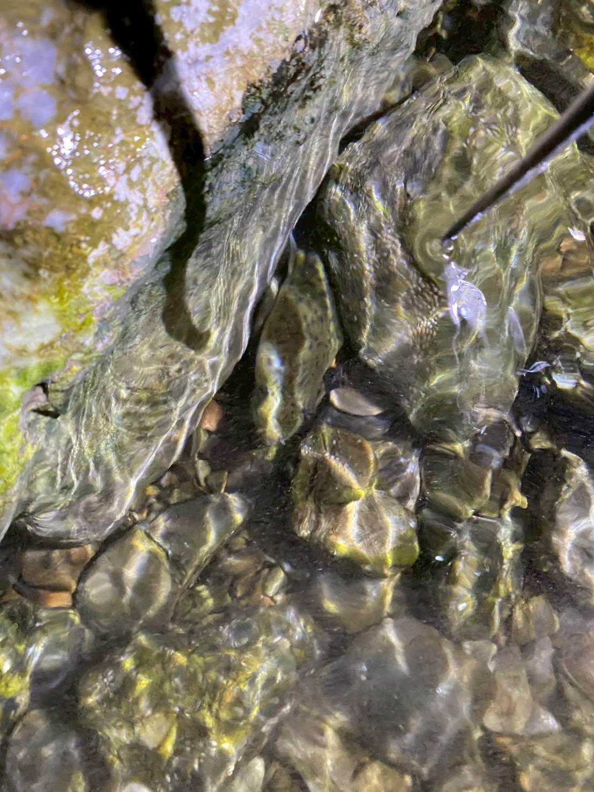  
実際のだとこんな感じ 
自分の腕より太いサイズですら、間違えて踏んでから気づいた、なんてこともあるくらいにはわからないです 
こんなに近づいても1mmも動かないんですよね... 
#### 狙い方
基本頭が見えていることが多いので頭を狙いますが、突く瞬間にすごい勢いで後ろに下がるので、できる限り奥を狙いましょう 
あとできれば、逃げている最中に狙うのはやめた方がいいです 
割と当たりはするんですが、結局逃げられるので無駄に傷つけてしまいます 
#### 刺したあとは？
とにかくすぐに岸に向かいましょう 
ホントにすぐに外してきます 
あとは刺したときにできた傷口を手でつかんだり、口に手を突っ込んで噛まれに行くとしっかりホールドできます　かむ力は弱いのでそこまで危なくはないです　推奨はしませんが 
#### 閉じ込めるまで油断はするな！
岸に上がっても油断しないように、まだ勝負は終わってません 
ウナギは水陸両用、雨の日だと陸すら泳ぐ生き物です 
陸に降ろしてしまった時点でほぼ逃げられます 
籠とかに入れるまでは油断しないでください 

 

昔話
 

> 昔、釣った大ウナギを実家の池で飼っていたことがありました 
> しばらくは何事もなかったのですが、ある日大雨の日にいなくなっていました 
> コンクリートでできた、大きめの水槽のような池なので、探しきれていないなんてことはなく、確実に消えていました 
>  
> その後、死骸となったウナギを見ることはありませんでした 
> 環境的に、死骸として見つかることなく移動できる場所は限られており、 
> 池から外へ出るなら、少なくとも 50m は移動する必要があります 
>  
> いろいろ考えた結果、 
> 池の近くの側溝まで泳いでいったのだろう、 
> という結論に落ち着きました 
>  
> 
>側溝から池までは10m以上ありました 

 

#### 釣るなら
モリ突き、普通に難しいし、下手したらむやみにウナギを傷つけるだけになりかねないので、モリ突きにそこまで興味を感じない場合は普通に釣りをお勧めします 

自分は基本、釣りの仕掛けをセットしてからモリを持って川に行きます 

 

記憶が曖昧なので、後から書きます
 

ウナギが嗅覚を頼りに餌を探すので、基本はにおいの強いサンマがおすすめ　奥共同店で買える 
ハリス何号...? 
針はタマン針の出来れば一番大きいもの 

 

## ちょっと危なめ！伊江川！
 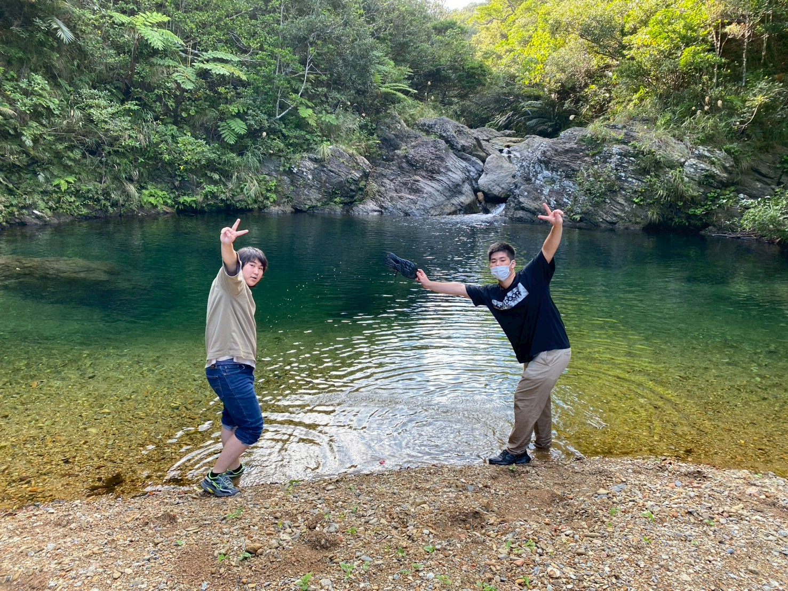  

Generate from: <a href="https://guildstudio.docbase.io/posts/3996168">3996168</a>
