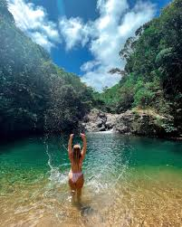
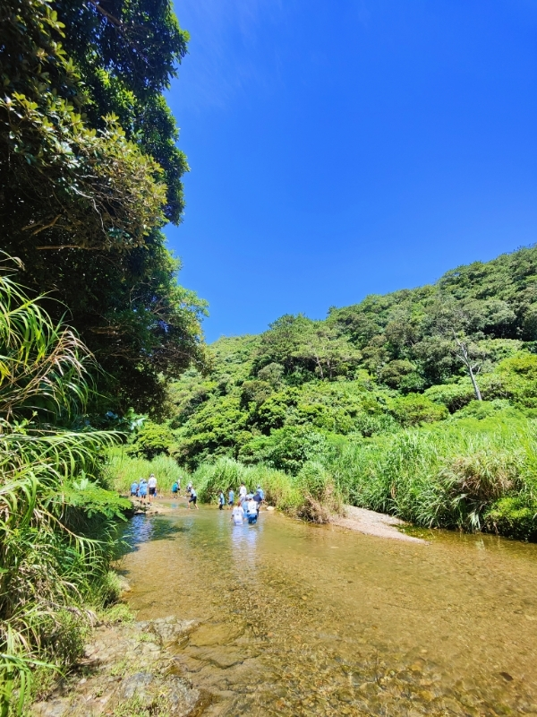

`go_to_yanbaru` 
※正月の帰省時に写真を撮ってから投稿するつもりだったのですが、ふるさと納税の更新？タイミングが12/31らしいので、一部は画像なしで投稿します 
※写真撮り次第更新します 

--- 

沖縄のふるさと納税色々調べていたら 
https://www.satofull.jp/products/detail.php?product_id=1578846&query_id=13998415-36cb-4f40-8057-00051395214b 
   
自分のお気に入りのペンションが出品されてました 

地元貢献も兼ねて、奥やんばるの里の宣伝です 

--- 
--- 

沖縄の自然を思いっきり楽しみたい... 

でも、危険な場所は行きたくない... 

子供たちのためにも、安心・安全な場所がいい... 

けど、大人の自分たちだって楽しみたい！ 

**その願い、すべて叶えます** 
**そう、奥やんばるの里なら！！！** 
# 奥やんばるの里とは！？
   
**沖縄の超最北端！！** 
国頭村奥に存在する、雄大な自然に囲まれたすごいところ！！ 
   
やんちゃな学生から、家族まで、誰だって楽しめる！ 
安心安全、そのうえで刺激的な遊びが盛りだくさんの 
(個人的には)沖縄NO.1のペンションです 

# その魅力とは！！
## 奥川
このペンション最大の特徴 
なんと、**ペンションから約30mの距離に川があります** 

**沖縄の全ての川を巡った自分が断言します** 

**この川、** 
**「家族で楽しめる川」としては圧倒的にNo.1です** 

なぜか？ 

それは―― 

**安全に遊べるよう整備されている** 
**それでいて、生き物はたくさんいる！！** 

これが両立できている数少ない川だからです 
### <u>まず安全性！</u>
   
この写真だけで大体伝わるのではないでしょうか 

まず第一に、**浅いので子供がおぼれる心配がありません** 
ほとんどのところは大人であれば膝下まで届かない程度には水深が浅く、溺れる心配はないです 

そして**川の周辺がめっちゃ整備されてます** 
ペンションから川への動線は芝生で整備されているので、ハブなどの脅威もほとんどないです 

ここまで安全なところはかなり珍しいです 

海みたいに岩が鋭くない、危険な生き物が少ないうえ、この好条件なので、 
沖縄で自然に触れられて、安全な場所として一番なんじゃないかな 
### <u>そして豊富な生態系！</u>
奥やんばるの里が位置するこの川は、<u>奥川の下流・ほぼ汽水域</u>にあたります 
そのため、満潮時には海水が入り込み、川と海の栄養が混ざり合う環境になっています 

その影響か、 
**整備された川としては珍しく、生き物がとても豊富**です 
というか遊べるように整備された川自体が珍しい 

 

どんな生き物がいるの？
 

#### <u>通常時にみられる生き物</u>
普段の水位だと、主に以下 
- ハゼ
- 小エビ
- 名前は分からないけど、ちっちゃい小魚たち
- 運が良ければ　**テナガエビ**

人にとって**脅威になる生き物は、ほとんど見かけないです** 

> ※テナガエビは沖縄県の[希少野生動植物種](https://www.pref.okinawa.jp/_res/projects/default_project/_page_/001/004/865/zyourei_panhu_dai3han.pdf)に指定されてます、食べないように！ 

#### <u>満潮時に見られる生き物</u>
汽水域なので、潮が満ちてくると海の生き物が入ってきます 
とはいえ、かなり浅い川なので、 
**危ないものが入ってくることはほとんどないです** 

結構いろんなのが入ってくるので、見られる生き物はほぼランダムにはなりますが、 
今までで見れたものの例としては 
- ハコフグ(8cmくらい)
- 小魚の群れ
- タツノオトシゴ

など 
なかでも、**ハコフグはほぼ毎回、** 
**小魚の群れもかなり高頻度**で見れます 

小魚の群れは、それを狙ってやってくる中型の魚の影響で、 
水面近くを一斉に跳ね回る瞬間が見られることもあり、 
この時間帯ならではの見どころのひとつです 

 

## 綺麗な施設
**ペンションあるある！！** 
**行ってみたら設備がちゃっちい！汚い！古い！！** 

これメチャクチャ心配ですよね 

**大丈夫です、ここの設備****超綺麗****です** 

### 外観
   

### 内装
   
 
1 ~ 3人用の志場（シーバー）がこんな感じ 
   
風呂場 
   
ベランダ 
   
1 ~ 5人用の尾西（ウニシ）だとベランダが豪華になります 

# この場所の楽しみ方
### 川を楽しむならこれ
潮の満ち引きで居るものがかなり変わるので、あらかじめ調べておくことをお勧めします 
https://www.surf-life.blue/weather/tide_level/%E5%9B%BD%E9%A0%AD%E6%9D%91%28%E8%BE%BA%E5%9C%9F%E5%90%8D%29 

川を楽しむために、道具を買うのもおすすめです 
自分のおすすめは以下 

**アクアスコープ** 
   
https://amzn.asia/d/7Unbd7c 
水中の生き物を見るのに最適です、子供向けではありますが大人が使っても結構楽しいです 

**水中用網** 
   
https://amzn.asia/d/97yCqUP 
網の先端が平たいこのタイプが一番最適です　水中での利用なら一番汎用的に使えるのがこのタイプです 
割といろんなとこで売ってます 

**奥やんばる限定網** 
写真はないですがこの奥やんばる唯一の商店、奥共同店で売っているおそらく手作りの針金と透明な糸で作られたシンプルな網 
目が粗く、小魚などをとるのには向きませんが、手長エビをとるのにはメチャクチャ向いています 
あったら是非買ってみてください 
### 早朝限定！ミジュン釣り！
   
奥やんばるから歩いて15分、奥港では早朝限定でミジュンの群れが現れることがあります 

### BBQ

# 真・この場所の楽しみ方
ここまでの説明を聞いて、こう思った方がいるのではないでしょうか 

**刺激が足りない** 

せっかく沖縄に来て、大自然を味わいに来たのに 
あるのは泳ぐにはあっさい川だけ 
生き物も満潮を狙わなければ、ちっちゃい小魚、良くて手長エビ 

このままだと 

**ただ川ではしゃぎまわり、花火を楽しみ、** 
**夜にはBBQを楽しみ、大自然特有のきれいな夜空を楽しみながら夜を過ごす―** 

**そんなありきたりな楽しみ方しかできない！！** 

**魚をモリで突いたり、イノシシ追い掛け回したり――** 
大人になる過程で誰しも一度はやるであろう、そういったやんちゃ  

**そういう刺激が欲しい！！** 

 

詳細
 

南部だとちらほらありますが基本汚い 

沖縄で遊べるタイプの川は基本子供には向いていない危険なところが多いです 

比較として、自分おすすめの伊江川とか↓ 
   
写真だけ見るときれいだなーて感じなんですが 
   
行く道中はこんなです 
川への入り口が汽水域しかないので、そこから歩いて上流まで行く必要があります 
因みにこの写真の先200mくらい歩くとあるのですが、この先は川の両端が2mくらいの草だけになってきます 
普通にハブ出ます 

 

Generate from: <a href="https://guildstudio.docbase.io/posts/3996168">3996168</a>
